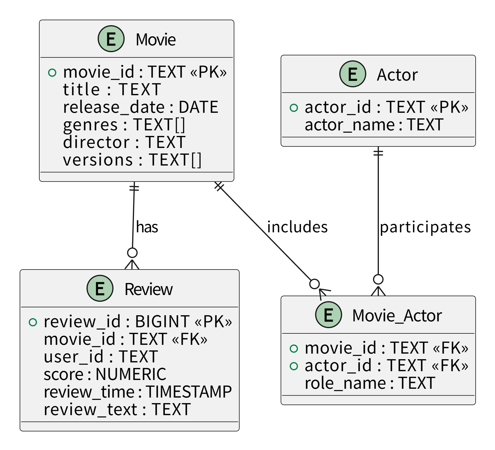

# 数据存储设计说明文件

---

## 一、项目背景与目标

本项目围绕电影及其周边信息，构建一个**多模型协同的数据仓库系统**，用于对比关系型数据库、分布式文件系统与图数据库在不同查询场景下的性能与适用性。

系统需要完成：

* 多源数据采集（Snap 文本 + Amazon 网页）
* 数据清洗、规范化、去重与溯源
* 多模型存储（关系型 / Hive / 图数据库）
* 常见统计查询与复杂关系分析
* 查询性能对比与可视化展示

---

## 二、整体存储模式设计

### 2.1 多模型协同架构

| 存储类型    | 系统          | 角色    | 存储内容       |
| ------- | ----------- | ----- | ---------- |
| 分布式文件存储 | Hive + HDFS | 主数据仓  | 原始+清洗后全量数据 |
| 关系型数据仓库 | openGauss   | 分析查询仓 | 规范化维度与事实表  |
| 图数据库    | Neo4j       | 关系分析仓 | 演员/导演/电影关系 |

Hive 作为**唯一事实来源（Source of Truth）**，openGauss 与 Neo4j 均从 Hive 派生数据。

---

## 三、ETL 数据流程设计

### 3.1 Extract（数据抽取）

**数据来源**：

* Snap：电影评论文本文件
* Amazon：电影详情与评论网页

**抽取字段统一规范**：

* 电影：`movie_id`、`title`、`release_date`、`genres`、`director`、`actors`、`versions`
* 评论：`user_id`、`profile_name`、`score`、`review_time`、`review_text`
* 治理字段：`source`、`source_file`、`review_unix`

---

### 3.2 Transform（数据转换）

**主要处理步骤**：

1. 非电影数据过滤
2. 字段标准化（时间、名称、评分）
3. 演员/导演名称规范化
4. 评论与电影实体关联
5. 去重（`movie_id` + `source_file`）
6. 派生字段（`year`、`month`）
7. 添加血缘与来源字段

---

### 3.3 Load（数据加载）

| 目标系统      | 加载策略       |
| --------- | ---------- |
| Hive      | 全量加载，字段不裁剪 |
| openGauss | 结构化子集      |
| Neo4j     | 抽取实体关系     |

---

## 四、分布式文件系统存储模型（Hive）

### 4.1 评论事实表 reviews_clean

```sql
CREATE EXTERNAL TABLE reviews_clean (
  review_id STRING,
  movie_id STRING,
  user_id STRING,
  profile_name STRING,
  score DOUBLE,
  review_time TIMESTAMP,
  review_unix BIGINT,
  review_text STRING,
  source STRING,
  source_file STRING
)
PARTITIONED BY (year INT, month INT)
STORED AS PARQUET;
```

### 4.2 电影元数据表 movies_meta

```sql
CREATE EXTERNAL TABLE movies_meta (
  movie_id STRING,
  title STRING,
  release_date DATE,
  genres ARRAY<STRING>,
  director ARRAY<STRING>,
  actors ARRAY<STRING>,
  starring ARRAY<STRING>,
  versions ARRAY<STRING>,
  source_files ARRAY<STRING>
)
STORED AS PARQUET;
```

**优化策略**：

* Parquet 列式存储
* 分区裁剪
* Spark SQL

---

## 五、关系型数据仓库设计（openGauss）
### 5.0 E-R 图设计（逻辑实体关系）

说明：
- Movie 是核心维度实体
- Review 是事实实体，记录用户评价行为
- Actor 为独立维度，通过 Movie_Actor 桥表与电影形成多对多关系
- 该 E-R 模型在物理实现时演化为 Star Schema（星型模型）

### 5.1 逻辑模型（Star Schema）

* 维度表：电影、演员
* 桥表：电影-演员
* 事实表：评论

### 5.2 表结构与字段说明

#### dim_movies

* movie_id：电影唯一标识
* title：电影名称
* release_date：上映日期
* genres：电影类型
* director：导演
* versions：不同版本

#### dim_actors

* actor_id：演员ID
* actor_name：演员姓名

#### movie_actor

* movie_id：电影ID
* actor_id：演员ID
* role_name：角色名

#### fact_reviews

* review_id：评论主键
* movie_id：电影ID
* user_id：用户ID
* score：评分
* review_time：评论时间
* review_text：评论内容

---

## 六、图数据库存储模型（Neo4j）

### 6.1 节点

* Movie
* Actor
* Director
* User

### 6.2 关系

* ACTED_IN
* DIRECTED
* REVIEWED

### 6.3 设计目标

用于回答复杂关系问题：

* 经常合作的演员
* 演员-导演合作网络
* 高关注演员组合

---

## 七、数据治理体系设计

### 7.1 治理目标

* 数据可追溯
* 数据可审计
* 数据一致性

### 7.2 元数据与标准

| 字段          | 说明            |
| ----------- | ------------- |
| `movie_id`    | 跨系统统一主键       |
| `source`      | snap / amazon |
| `source_file` | 原始文件或网页       |

### 7.3 数据质量规则

* 必须存在 `movie_id`
* 去重规则：`movie_id` + `source_file`
* 非电影数据拒绝入仓

---

## 八、数据血缘设计

### 8.1 表级血缘

Snap/Amazon → Hive → openGauss / Neo4j

### 8.2 字段级血缘示例

Amazon.review_text → Hive.reviews_clean.review_text → openGauss.fact_reviews.review_text

### 8.3 溯源支持

* source_file 支持网页级溯源
* source 支持来源统计

---

## 九、测试用例示例

| 查询目标    | 存储系统             |
| ------- | ---------------- |
| 按年统计电影数 | Hive / openGauss |
| 演员合作关系  | Neo4j            |
| 评论量统计   | Hive             |
| 高评分电影   | openGauss        |

---

## 十、总结

本系统通过 Hive、openGauss 与 Neo4j 的协同，构建了一套可追溯、可扩展、可对比的数据仓库体系，满足课程项目对数据存储、治理与性能评估的全部要求。
